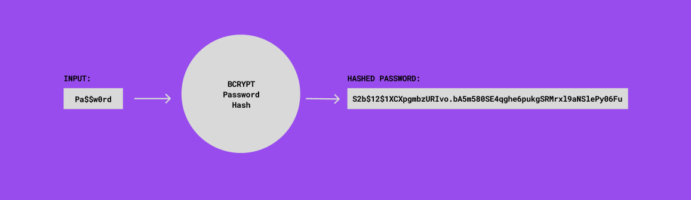

Welcome to our premier ecommerce website, dedicated to bringing you the best selection of video games available online. Our platform is a gaming enthusiast's paradise, designed to cater to every gamer's needs.

Navigating our website is a breeze, thanks to our intuitive interface and advanced search filters. Whether you're searching for a specific game, genre, or even a particular developer you'll find it effortlessly with our user-friendly tools.

To enhance your shopping experience, we provide detailed game descriptions giving you valuable insights before making a purchase. Our goal is to help you make informed decisions and find games that match your preferences perfectly.

With a commitment to customer satisfaction, we prioritize security and convenience. Rest assured that your personal information is handled securely.

Upon reaching the checkout page, you'll find a clear and concise summary of your selected items, along with their prices, quantities, and any applicable discounts or promotions. You can easily review and modify your order before proceeding.

For returning customers, we offer a convenient one-click checkout option, saving you time and effort. Your shipping and billing information can be securely stored for future purchases, allowing for a swift and hassle-free experience.

Join our thriving community of gamers and explore the world of video games like never before. Whether you're a casual player or a hardcore gamer, our ecommerce website is your go-to destination for all your gaming needs. Start browsing now and unleash your gaming passion!

Tools -

- [Vite](https://vitejs.dev)
- [React](https://reactjs.org/)
- [Node-Postgres](https://node-postgres.com/)
- [Express](https://expressjs.com/)
- [React Router DOM](https://reactrouter.com/en/main)
- [Axios](https://axios-http.com/docs/intro)
- [Morgan](https://www.npmjs.com/package/morgan)
- [jsonwebtoken](https://www.npmjs.com/package/jsonwebtoken)
- [bcrypt](https://www.npmjs.com/package/bcrypt)
- [dotenv](https://www.npmjs.com/package/dotenv)
- [Nodemon](https://www.npmjs.com/package/nodemon)

